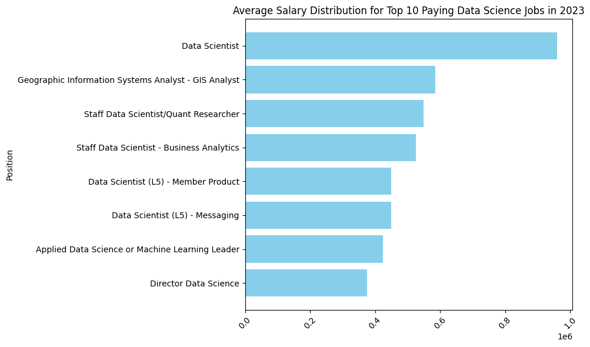
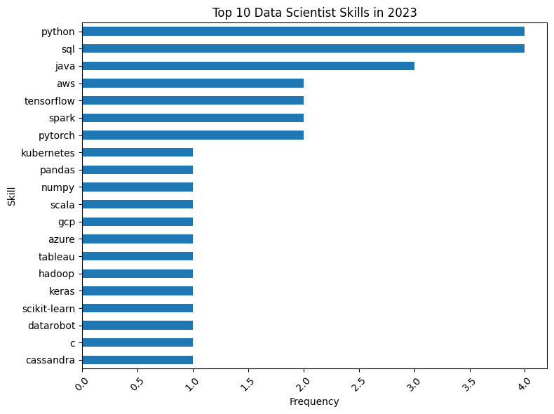

# Introduction
Diving into the data job market! Focusing on data science roles, this project explores top-paying jobs, in demand skills, and where high demand meets high salary in data science. 

SQL queries? Check them out here: [sql_project folder](/sql_project/)

# Background
This project was inspired by a SQL tutorial created by Luke Barousse on YouTube, which I used to strengthen my SQL querying, joining, and data‑analysis skills. While the tutorial focused primarily on Data Analyst roles, I adapted the workflow to center my analysis on Data Scientist positions instead. Using a relational database of job postings, skills, and salary information, I performed a series of joins, aggregations, and filters to identify which technical skills appear most frequently in Data Scientist roles and which skills are associated with the highest average salaries. By shifting the lens from analytics to data science, the project highlights the tools, programming languages, and platforms that drive value in more advanced, model‑driven roles within the tech job market.

## The questions I wanted to answer through my SQL queries were:
1. What are the top-paying data scientist jobs?
2. What skills are required for these top-paying jobs?
3. What skills are most in demand for data scienctists?
4. Which skills are associated with higher salaries?
5. Wat are the most optimal skills to learn for data science? 
# Tools Used
* **SQL** — used to query, join, filter, and aggregate data across multiple relational tables to analyze skill demand and salary trends.
* **PostgreSQL** — served as the database engine for storing the job‑posting dataset and executing all SQL queries throughout the project.

* **Visual Studio Code (VS Code)** — used as the primary development environment for writing, organizing, and running SQL scripts.

* **Git & GitHub** — used together for version control and repository management, allowing clean tracking of project changes and cloud‑based storage of the final analysis.
# The Analysis 
Each query for this project aimed at investigating specific aspects of the data science job market. Here's how I approached each question.

### 1. Top-Paying Data Science Jobs
To identify the highest-paying roles I filetered data science positions by average year salary and location. This query highlights the high paying opportunities in the field.

```SQL
SELECT
    job_id,
    job_title,
    job_location,
    salary_year_avg,
    job_posted_date,
    name AS company_name
FROM
    job_postings_fact
LEFT JOIN company_dim 
    ON job_postings_fact.company_id=company_dim.company_id
WHERE
    job_title_short ='Data Scientist' AND
    salary_year_avg IS NOT NULL
ORDER BY
    salary_year_avg DESC
LIMIT 10
```
Here's the breakdown of the top 10 data science jobs in 2023:
*  **Wide Salary Range:** Top 10 paying data science roles span from $960,000 to $375,000, indicating significant salary potential in this field 
* **Diverse Employeers:** Companies like Easter River Electric Power Cooperative, Inc., ReServe, Selby Jennings, and Netflix are among those offering salaries, showing a broad interest across varying industries.
* **Job Title Variety:** There was a variety of job titles, from Data Scientist to Geopgraphic Information Systems Analyst, reflecting varied roels and specilizations within the field of data science. 


*Bar grapgh visualizing the salary for the top 10 salaries for data scientists; Generated using python from SQL query results.*


### 2. Top Paying Skills for Data Scientists 
To figure out the top paying skills for Data Scientists I first created a CTE that filtered the dataset to Data Scientists roles with valid salary data, sorted them by highest avg salary, and returned the top ten positions. I then joined this CTE to the skills tables to pull each skill associated with these high-paying jobs. This query shows the highest paying skills in the field 

```SQL
WITH top_paying_jobs AS (

    SELECT
        job_id,
        job_title,
        salary_year_avg,
        name AS company_name
    FROM
        job_postings_fact
    LEFT JOIN company_dim ON job_postings_fact.company_id=company_dim.company_id
    WHERE
        job_title_short ='Data Scientist' AND
        salary_year_avg IS NOT NULL
    ORDER BY
        salary_year_avg DESC
    LIMIT 10

)

SELECT 
    top_paying_jobs.*,
    skills
FROM top_paying_jobs
INNER JOIN skills_job_dim ON top_paying_jobs.job_id=skills_job_dim.job_id
INNER JOIN skills_dim ON skills_job_dim.skill_id=skills_dim.skill_id
ORDER BY
    salary_year_avg DESC
```
Here's a breakdown of the Top 10 highest paying skills for Data Scientists
* **Core Data Science & Modeling Skills:** 
Top skills were Python and SQL followed by various ML, statisitcs, and data visualization softwares.  
* **Maching Learning Engineering and Cloud Skills:** Cloud based ML skills like AWS, Azure, and GCP were some of the highest ranking suggesting that companies are willing to pay more for Data Scientists who can delpoy and maintain production-ready ML systems. 
* **Specalization and High-Value Tech SKills:** Another thing that stuck out was how specialized skills  focused on specific avenues of ML payed more. 


*Bar grapgh visualizing the top ten highest paying skills in Data Science; Generated using python from SQL query results.*

### 3. Top Demanded Skills for Data Scientists 
I identified the top-demanded skills for Data Scientists by joining by job postings and skills tables. Then I filtered the dataset to only Data Scientist roles and counted how often each skill appeared. Finally, I grouped the results by skill and sorted them by frequency to reveal the five most in-demand skills. This query makes it clear to job-seekers which skills they should focus on for success in the field. 

```SQL

SELECT 
    skills,
    COUNT(skills_job_dim.skill_id) AS demand_count
FROM job_postings_fact
INNER JOIN skills_job_dim ON        job_postings_fact.job_id=skills_job_dim.job_id
INNER JOIN skills_dim ON skills_job_dim.skill_id=skills_dim.skill_id
WHERE
    job_title_short = 'Data Scientist' 
GROUP BY 
    skills
ORDER BY
    demand_count DESC
LIMIT 5
```
Here's a breakdown of the Top 5 most in-demand skills for Data Scientists
* **Python:** 
Python leads with over 114,000 mentions, showing it's the core programming langauage for data science work, from modeling to automation.  
* **SQL:** With 79,000 mentions, SQL remains essential for querying, cleaning, and managing data across large databasses. 
* **R:** R appears nearly 60,000 times, reflecting its strong use in statistical analysis, research workflows, and academic-leaning data science roles. 
* **SAS:** SAS shows 29,000 mentions, indicating continued demand in industries healthcare, finance, and government where legacy analytic tools are common.
* **Tableua:** Tableau, at 29,000 mentions, highlights the importance of data vissualizatoin and dashboarding for communciating insights to stakeholders. 


*Table visualizing the top five most in-demand skills in Data Science; Generated using CoPilot from SQL query results.*

| Skill   | Demand Count |
|---------|--------------|
| Python  | 114,016      |
| SQL     | 79,174       |
| R       | 59,754       |
| SAS     | 29,642       |
| Tableau | 29,513       |

### 4. Top Paying Skills Based On Salary 
I studied the top paying salaries to see how it affects the skills needed for those roles. To do this I averaged all the salaries in my dataset and analyzed the skills associated with each of the highest salaries. I then sorted the dataset by the highest salaries to see what were the top 25 skills associated with these roles. The SQL query below highlight's these skills and the salaries that were associated with them. 

```SQL
SELECT 
    skills,
    ROUND(AVG(salary_year_avg),0) AS avg_salary
FROM job_postings_fact
INNER JOIN skills_job_dim on job_postings_fact.job_id = skills_job_dim.job_id
INNER JOIN skills_dim ON skills_job_dim.skill_id = skills_dim.skill_id
WHERE
    job_title_short = 'Data Scientist'
    AND salary_year_avg IS NOT NULL
GROUP BY
    skills
ORDER BY
    avg_salary DESC
LIMIT 25
```

Here's a breakdown of the results from the Top 25 skils associated with high-paying roles for Data Scientists 

* **Workflow and Collaboration:** 
Many of the highest‑paying skills are workflow and collaboration tools like Asana, Airtable, Slack, Notion, and Zoom, which are used for project management, team coordination, and cross‑functional communication.

* **Niche Programming Languages:**
Several niche programming languages—such as Elixir, Lua, Haskell, and Objective‑C—appear near the top because they’re used for high‑performance systems, backend services, and specialized application development, where talent is scarce.

* **Data and ML-focus:**
Data and ML‑focused tools like BigQuery, Airflow, DynamoDB, Hugging Face, and Theano show strong salaries due to their roles in data engineering pipelines, large‑scale storage, and modern machine learning workflows.

* **Frameworks:**
Frameworks like Ruby on Rails, RShiny, and Unity highlight demand for web development, data visualization, and interactive application design in high‑impact roles.


*Table visualizing the top five most in-demand skills in Data Science; Generated using CoPilot from SQL query results.*

| Skill           | Avg Salary ($) |
|-----------------|----------------|
| asana           | 215,477        |
| airtable        | 201,143        |
| redhat          | 189,500        |
| watson          | 187,417        |
| elixir          | 170,824        |
| lua             | 170,500        |
| slack           | 168,219        |
| solidity        | 166,980        |
| ruby on rails   | 166,500        |
| rshiny          | 166,436        |
| notion          | 165,636        |
| objective-c     | 164,500        |
| neo4j           | 163,971        |
| dplyr           | 163,111        |
| hugging face    | 160,868        |
| dynamodb        | 160,581        |
| haskell         | 157,500        |
| unity           | 156,881        |
| airflow         | 155,878        |
| codecommit      | 154,684        |
| unreal          | 153,278        |
| theano          | 153,133        |
| zoom            | 151,677        |
| bigquery        | 149,292        |
| atlassian       | 148,715        |


### 5. Most Optimal Skills for Data Scientists to Learn 
I took what I learned from the previous query's and combined that knowledge to find the most optimal skills for data scientists to learn. To do this I built two CTE's: one that calcauted how often each skill appeared in job postings and another that computed the average salary for jobs requring each skill. I then joined the two CTE's and filtered the data to only include skills that appeared in more than 10 job postings. Lastly, I ranked the results first by highest avg salary and then highest demand count. The query below highlights the most valuable skills, that are both widly requested and linked to higher-paying Data Scientist positions. 

```SQL
WITH skills_demand AS (
SELECT 
    skills_dim.skill_id,
    skills_dim.skills,
    COUNT(skills_job_dim.skill_id) AS demand_count
FROM job_postings_fact
INNER JOIN skills_job_dim ON job_postings_fact.job_id=skills_job_dim.job_id
INNER JOIN skills_dim ON skills_job_dim.skill_id=skills_dim.skill_id
WHERE
    job_title_short = 'Data Scientist'
    AND salary_year_avg IS NOT NULL

GROUP BY 
    skills_dim.skill_id
), average_salary AS(
    SELECT 
        skills_dim.skill_id,
        ROUND(AVG(salary_year_avg),0) AS avg_salary
    FROM job_postings_fact
    INNER JOIN skills_job_dim on job_postings_fact.job_id = skills_job_dim.job_id
    INNER JOIN skills_dim ON skills_job_dim.skill_id = skills_dim.skill_id
    WHERE
        job_title_short = 'Data Scientist'
        AND salary_year_avg IS NOT NULL
    GROUP BY
        skills_dim.skill_id
)

SELECT
    skills_demand.skill_id,
    skills_demand.skills,
    demand_count,
    avg_salary
FROM
    skills_demand
INNER JOIN average_salary on skills_demand.skill_id = average_salary.skill_id
WHERE
    demand_count >10
ORDER BY
    avg_salary DESC,
    demand_count DESC
```
Here's a breakdown of the most optimal skills for Data Scientists

* **AI & ML Framworks:** 
SKills like Hugging Face, PyTorch, MXNet, and Theano all appeared with strong demand and salaries reflecting the growing importance of deep learning, NLP, and model delployment in Data Scientist Roles.  
* **Cloud & Big Data Engineering:** Airflow, BigQuery, Spark, and Snowflake represent the data engineering sector showing that companies are valuing advanced data pipelines and advanced storage system managemnet. 
* **Programming Languages:** Go, Scala, and Golang appeared frequently suggesting their value in production-grade data systems, backend ML services, and high-performance computing enviornments. 
* **Analytics and Visualization Platforms:** RShiny, Looker, MicroStrategy, and Express highlight the need for tools that can turn data into insights.
* **Collaboration, Productivity & Compliance Tools:** Slack, Notion, Zoom and other tools demonstrate the need for Data Scientists to not only have technical skills, but proper knowledge on communciation, governance, and cross-functional worflows. 


*Table visualizing the most optimal skills in Data Science; Generated using CoPilot from SQL query results.*

| Category                               | Skill          | Demand Count | Avg Salary |
|----------------------------------------|----------------|--------------|------------|
| AI & Machine Learning Frameworks       | Hugging Face   | 18           | $160,868   |
| AI & Machine Learning Frameworks       | PyTorch        | 564          | $145,989   |
| AI & Machine Learning Frameworks       | TensorFlow     | 641          | $143,440   |
| AI & Machine Learning Frameworks       | MXNet          | 20           | $144,874   |
| AI & Machine Learning Frameworks       | Theano         | 25           | $153,133   |
| Cloud & Big Data Engineering           | Airflow        | 144          | $155,878   |
| Cloud & Big Data Engineering           | BigQuery       | 135          | $149,292   |
| Cloud & Big Data Engineering           | Spark          | 946          | $144,399   |
| Cloud & Big Data Engineering           | Snowflake      | 313          | $142,691   |
| Cloud & Big Data Engineering           | DynamoDB       | 12           | $160,581   |
| Cloud & Big Data Engineering           | Neo4j          | 32           | $163,971   |
| Programming Languages                  | Go             | 316          | $147,466   |
| Programming Languages                  | Scala          | 381          | $145,056   |
| Programming Languages                  | Golang         | 14           | $144,090   |
| Analytics & Visualization Platforms    | RShiny         | 17           | $166,436   |
| Analytics & Visualization Platforms    | Looker         | 186          | $147,538   |
| Analytics & Visualization Platforms    | MicroStrategy  | 31           | $143,343   |
| Analytics & Visualization Platforms    | Express        | 89           | $148,333   |
| Collaboration, Productivity & Compliance | Slack         | 17           | $168,219   |
| Collaboration, Productivity & Compliance | Notion        | 11           | $165,636   |
| Collaboration, Productivity & Compliance | Zoom          | 18           | $151,677   |
| Collaboration, Productivity & Compliance | Atlassian     | 23           | $148,715   |
| Collaboration, Productivity & Compliance | GDPR          | 21           | $142,981   |
| Specialized AI Platform                | Watson         | 14           | $187,417   |

# What I learned 
I strengthened my SQL skills through hands‑on practice that pushed me to work with real datasets and more advanced query patterns.

Learned how to use joins to combine tables effectively

Practiced aggregation to summarize and interpret data

Built and applied CTEs to organize complex logic

Increased my overall comfort and fluency working in SQL

By working through these techniques repeatedly, I became much more confident analyzing data and writing structured, efficient queries.

# Conclusions

### Insights 

From my analysis several insights emerged as follows: 

1. **Foundational data science skills remain essentioal** Python, SQL, and core analytical tools continue to dominate demand because they pwoer modeling, data manipulatoin, and insight generation across nearly all roles. 
2. **Modern ML frameworks and cloud technologies drive higher value** Tools like Hugging Face, PyTorch, Airflow, BigQuery, and major cloud platforms show strong demand and higher salaries as companies prioritize scalable, production-ready machine learning systems. 
3. **Data engineering and large-scale infrastructure skills are increasingly important** Spark,Snowflake, DynamoDB, and other big-data technologies highlight the shift tward robust pipelines, distibuted storage, and high-volume processing. 
4. **Visualization and application‑building tools support communication and impact**
Platforms such as Tableau, RShiny, Looker, and MicroStrategy reinforce the need for Data Scientists to translate complex data into clear, actionable insights.

5. **Collaboration and workflow tools matter more than expected** 
High‑paying roles frequently require tools like Slack, Notion, Asana, Airtable, and Zoom, reflecting the importance of cross‑functional communication and project coordination.

6. **Specialized or niche technologies correlate with higher compensation** 
Less common languages and frameworks—such as Elixir, Haskell, Lua, and Objective‑C—tend to pay more due to their scarcity and use in high‑impact, performance‑critical systems.

7. **The highest‑paying roles span diverse industries and job titles**
Employers range from tech companies to utilities, finance, and government, showing that advanced data skills are valued across many sectors and career paths.

### Final Thoughts 

One of the biggest takeaways from this project is the importance of continuously practicing and teaching yourself new skills. The data science landscape changes fast, and staying competitive means being willing to explore new tools, experiment with unfamiliar technologies, and build projects that push your abilities a little further each time. This analysis was a reminder that growth in this field doesn’t come from knowing everything — it comes from being curious enough to keep learning.

A special shout‑out goes to **Luke Barousse’s YouTube tutorial**, which helped guide the structure of this project and reinforced how accessible self‑driven learning can be when you have the right resources. Combining hands‑on practice with high‑quality learning materials is one of the most effective ways to build real, career‑ready skills.